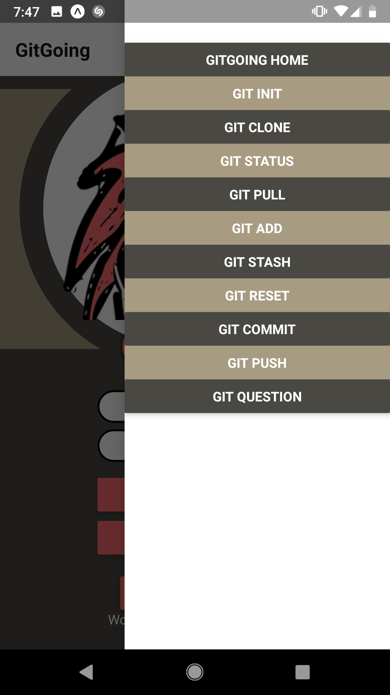
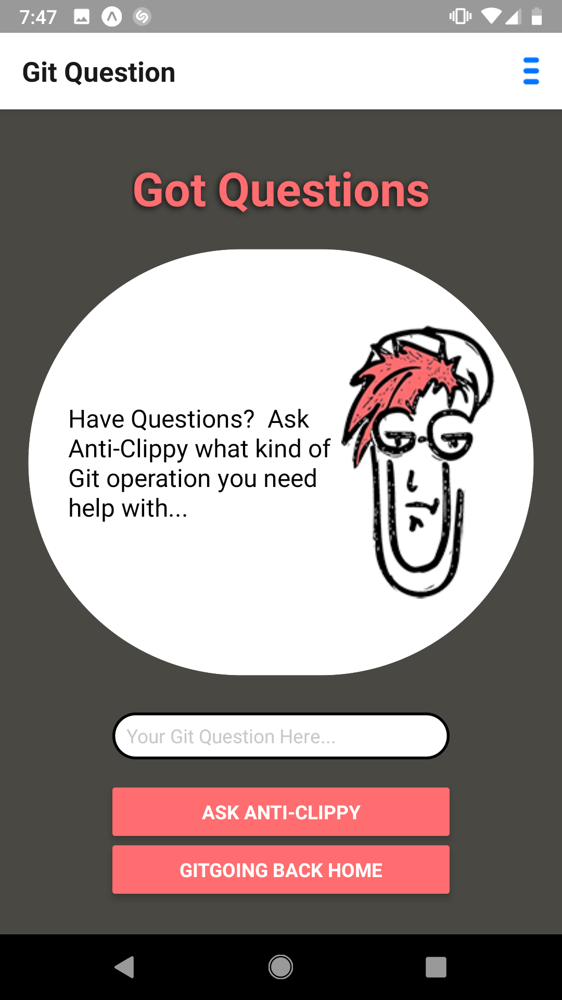

# GitGoing

The goal of this application is to familiarize users with the open-source platform, Git. 

Users can access the commands in several ways. 

Using the navigation button at the top right of the screen, the user can click on a link to get a definition of what each git command does.

Also, by clicking on the "GIT QUESTION" link, the user can ask anti-clippy what command to use for what they would like to accomplish.

# Technologies Used
* React Native
* HTML
* CSS
* JavaScript
* Expo
* Firebase

